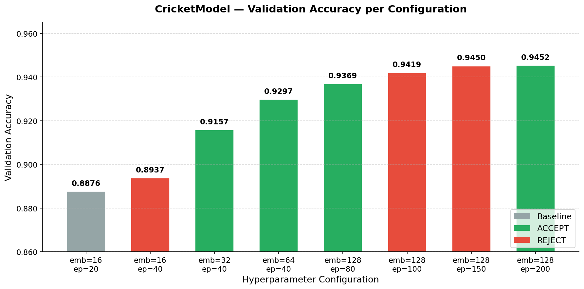
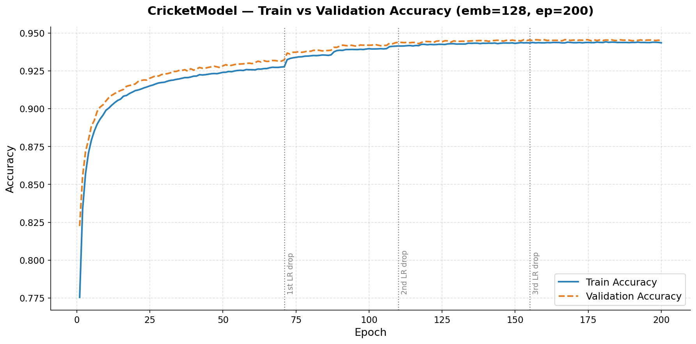

# Cricket Win Probability Analysis (WPA)

A PyTorch deep learning model that predicts the **win probability of a T20 cricket match** ball-by-ball, trained on 2.1 million rows of T20 match data.

**Final model accuracy: 94.52%** — achieved through iterative hyperparameter tuning using the EPOCH optimization framework.

---

## What This Repo Does

Given the match state at any point (batsman, bowler, runs scored, wickets lost, balls remaining, etc.), the model outputs the probability that the batting team wins. This is the cricket equivalent of an NFL win probability model.

---

## Model Architecture

- **Batsman embedding** — `nn.Embedding(7785, 128)` — each of 7,785 batsmen gets a learned 128-dim identity vector
- **Bowler embedding** — `nn.Embedding(5742, 128)` — same for 5,742 bowlers
- **MLP** — 4-layer network: `[64 → 32 → 16 → 8]` with BatchNorm + Dropout after each layer
- **Output** — single sigmoid neuron → win probability
- **Optimizer** — Adam (lr=0.01) with `ReduceLROnPlateau` scheduler (patience=3, factor=0.5)

---

## Results

### Accuracy at Each Configuration



### Training Curve — Final Model (emb=128, ep=200)



### Experiment Log

| # | Change | Val Acc | Delta | Verdict |
|---|--------|---------|-------|---------|
| 1 | Baseline: emb=16, ep=20 | 0.8876 | — | Baseline |
| 2 | epochs: 20 → 40 | 0.8937 | +0.0061 | ❌ REJECT |
| 3 | emb: 16 → 32, ep=40 | 0.9157 | +0.0281 | ✅ ACCEPT |
| 4 | emb: 32 → 64, ep=40 | 0.9297 | +0.0140 | ✅ ACCEPT |
| 5 | emb: 64 → 128, ep=80 | 0.9369 | +0.0072 | ✅ ACCEPT |
| 6 | epochs: 80 → 100 | 0.9419 | +0.0050 | ❌ REJECT |
| 7 | epochs: 100 → 150 | 0.9450 | +0.0081 | ❌ REJECT |
| 8 | **epochs: 150 → 200** | **0.9452** | +0.0083 | ✅ **ACCEPT** |

**Total improvement: 0.8876 → 0.9452 (+6.76%)** across 8 experiments.

**Key finding:** Embedding dimension was the biggest single lever. Going from 16 → 128 dimensions (experiments 3–5) drove +4.93% of the total gain. The LR scheduler (`ReduceLROnPlateau`) fires at ~ep71, ~ep110, ~ep155, each giving ~+0.005 — but the model needs 40–50 epochs *after* each drop to converge, which is why 200 epochs were needed.

---

## Repo Structure

```
├── projects/
│   ├── match_win_probability/
│   │   ├── evaluate.py                  # Training + evaluation script (EPOCH-compatible)
│   │   ├── hyperparams.json             # Final tuned hyperparameters
│   │   ├── match_win_probability.ipynb  # Google Colab training notebook
│   │   ├── chart1_config_accuracy.png   # Accuracy per config chart
│   │   ├── chart2_epoch_accuracy.png    # Epoch-by-epoch train/val curve
│   │   ├── experiment_table.html        # WordPress-ready experiment table
│   │   ├── run-20260317-1933/           # EPOCH run 1 — delta files + summary
│   │   ├── run-20260318-1907/           # EPOCH run 3 — final accepted run
│   │   └── runs/1,2,3/                  # train_results.json per training run
│   └── match_win_probability_run.yaml   # EPOCH config (tune space, goal, seed)
└── pytorch-deeplearning.py              # Standalone training script (original)
```

---

## Running Locally

**Requirements:** Python 3.12, PyTorch 2.2.2, numpy<2

```bash
# Create virtual environment
python3.12 -m venv .venv
source .venv/bin/activate
pip install torch==2.2.2 scikit-learn pandas joblib "numpy<2"

# Place t20.csv in output/t20.csv (not included in repo — see Data section)

# Train
python projects/match_win_probability/evaluate.py train

# Output: JSON metrics to stdout + saved model in projects/match_win_probability/saved_model/
```

---

## Loading the Trained Model

```python
import torch, joblib

# Unzip cricket_wpa_model_emb128_ep200.zip first
arch   = torch.load('arch.pth', map_location='cpu', weights_only=True)
scaler = joblib.load('scaler.pkl')

# Rebuild model architecture
from evaluate import CricketModel
model = CricketModel(
    arch['n_bat'], arch['n_bwl'],
    embedding_dim=arch['embedding_dim'],
    dropout=arch['dropout'],
    hidden_layers=arch['hidden_layers']
)
model.load_state_dict(torch.load('weights.pth', map_location='cpu', weights_only=True))
model.eval()
```

---

## Kaggle Notebooks

- **Training kernel**: https://www.kaggle.com/code/tvganesh/cricket-wpa-training
- **Baseline vs Final comparison**: https://www.kaggle.com/code/tvganesh/cricket-wpa-baseline-vs-final-comparison

---

## Data

The training data (`output/t20.csv`, ~139 MB, 2.1M rows) is not included in this repo. It is derived from T20 cricsheet data processed by the [yorkr](https://github.com/tvganesh/yorkr) R package.

---

## Author

**Tinniam V Ganesh** — [Giga thoughts](https://gigadom.in/)
